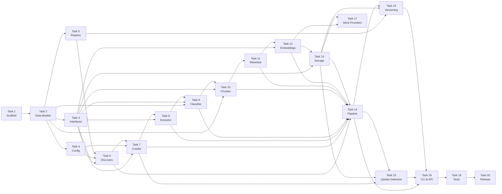

# DocForge — Implementation Plan

> **Automatically discovers, crawls, versions, chunks, and indexes official software documentation into a RAG-ready knowledge base.**

**Status:** Design Phase → Implementation  
**License:** Apache 2.0  
**Goal:** `docforge index postgresql` → queryable vector store, zero manual steps.

---

## How to Read This Plan

Tasks are ordered by dependency. You cannot start a task until all tasks it **depends on** are complete.  
Each task has a clear **definition of done** — you know it's finished when the listed criteria are met.  
Estimated effort is in **days of focused work**.

---

## Task Overview

```
PHASE 1 — FOUNDATION (Tasks 1–5)
PHASE 2 — PIPELINE CORE (Tasks 6–11)
PHASE 3 — INTELLIGENCE (Tasks 12–14)
PHASE 4 — INCREMENTAL & PROVIDERS (Tasks 15–17)
PHASE 5 — PRODUCTION QUALITY (Tasks 18–20)
```

---

## PHASE 1 — Foundation

### Task 1 — Project Scaffold & Tooling

**Effort:** 2 days  
**Depends on:** Nothing — start here.

Set up the repository so every contributor starts from a consistent, well-configured base.

**What to build:**
- `pyproject.toml` using PEP 621 + `hatchling` as the build backend
- Dependency groups: `core`, `dev`, `docs`, and optional extras (`js`, `ml`, `openai`, `qdrant`, `faiss`, `lancedb`, `weaviate`)
- `ruff` for linting and formatting (replaces flake8 + black + isort)
- `mypy` for static type checking
- `pre-commit` hooks: ruff, mypy, trailing whitespace, end-of-file newline
- GitHub Actions CI workflow: runs lint + tests on every PR
- `Makefile` with shortcuts: `make lint`, `make test`, `make format`, `make build`
- `README.md` skeleton with project description, install instructions, and quickstart example
- `CONTRIBUTING.md` with dev setup, branch naming, and PR checklist
- `src/docforge/` package layout (src layout, not flat)
- `src/docforge/__init__.py` and `src/docforge/__main__.py`
- `src/docforge/_version.py`

**Definition of done:**
- [ ] `pip install -e ".[dev]"` works without errors
- [ ] `make lint` passes on the empty scaffold
- [ ] `make test` runs (zero tests, zero failures)
- [ ] CI passes on GitHub

---

### Task 2 — Core Data Models

**Effort:** 2 days  
**Depends on:** Task 1

Define the Pydantic v2 data models that flow through every pipeline stage. Every other task depends on these shapes being locked in.

**What to build (`src/docforge/core/models.py`):**

| Model | Fields (key ones) |
|---|---|
| `DiscoveryResult` | `software`, `display_name`, `base_url`, `versions`, `latest_version`, `sitemap_url`, `content_selectors`, `url_filters` |
| `FetchResult` | `url`, `status_code`, `html`, `headers`, `etag`, `last_modified`, `fetched_at` |
| `ExtractedPage` | `url`, `title`, `markdown`, `headings`, `code_blocks`, `breadcrumb`, `raw_metadata` |
| `ClassifiedPage` | inherits `ExtractedPage` + `page_type: PageType`, `confidence: float` |
| `PageType` | Enum: `TUTORIAL`, `API_REFERENCE`, `FUNCTION_REFERENCE`, `GUIDE`, `CONCEPTS`, `EXAMPLES`, `RELEASE_NOTES`, `FAQ`, `CONFIGURATION`, `TROUBLESHOOTING`, `GETTING_STARTED`, `MIGRATION`, `UNKNOWN` |
| `ChunkMetadata` | `chunk_id`, `parent_page_id`, `software`, `version`, `url`, `title`, `page_type`, `breadcrumb`, `section_heading`, `chunk_index`, `total_chunks`, `has_code`, `code_languages`, `content_hash`, `crawl_timestamp`, `embedding_model`, `embedding_dimension`, `docforge_version` |
| `Chunk` | `content: str`, `metadata: ChunkMetadata` |
| `EmbeddedChunk` | inherits `Chunk` + `vector: list[float]` |
| `SearchResult` | `chunk_id`, `content`, `metadata`, `score: float` |

Also define chunk ID generation logic: `SHA-256(software|version|canonical_url|section_heading|chunk_index)`.

**Definition of done:**
- [ ] All models instantiate correctly with sample data
- [ ] All models serialise to and from JSON (`.model_dump()`, `.model_validate()`)
- [ ] `mypy` passes on `models.py`
- [ ] Unit tests for ID generation determinism

---

### Task 3 — Core Interfaces (Plugin ABCs)

**Effort:** 1 day  
**Depends on:** Task 2

Define the abstract base classes that enforce the plugin contract. No concrete implementations yet — just the interfaces every plugin must satisfy.

**What to build (`src/docforge/core/interfaces.py`):**

| Interface | Key abstract methods |
|---|---|
| `DiscoveryProvider` | `async discover(name: str) → DiscoveryResult` |
| `CrawlFetcher` | `async fetch(url: str) → FetchResult` |
| `ContentExtractor` | `async extract(fetch_result: FetchResult) → ExtractedPage` |
| `PageClassifier` | `classify(page: ExtractedPage) → ClassifiedPage` |
| `ChunkingStrategy` | `chunk(page: ClassifiedPage) → list[Chunk]` |
| `EmbeddingProvider` | `async embed_batch(texts: list[str]) → list[list[float]]`, `model_name: str`, `dimension: int`, `max_tokens: int` |
| `VectorStore` | `async initialize(config)`, `async upsert(chunks)`, `async search(query_vector, k, filters)`, `async delete(filters)`, `async count(filters)`, `async close()` |

Each ABC must have:
- Full docstrings explaining the contract
- Type annotations on every method
- `@abstractmethod` decorators

**Definition of done:**
- [ ] All ABCs defined with correct signatures
- [ ] A dummy implementation of each ABC can be instantiated without error
- [ ] `mypy` passes

---

### Task 4 — Configuration System

**Effort:** 2 days  
**Depends on:** Task 2

Build the configuration loader that reads from multiple sources and validates with Pydantic.

**What to build (`src/docforge/core/config.py`):**

Config is loaded in this priority order (highest wins):
1. Explicit Python API arguments
2. Environment variables (`DOCFORGE_*`)
3. Project-level `docforge.toml`
4. User-level `~/.config/docforge/config.toml`
5. Built-in defaults

**Config schema (key sections):**

```toml
[general]
data_dir = "~/.docforge"
log_level = "INFO"
parallelism = 8

[crawler]
max_pages_per_version = 5000
rate_limit_rps = 5
timeout_seconds = 30
retry_attempts = 3
retry_backoff = "exponential"
respect_robots_txt = true
enable_js_rendering = false
cache_ttl_hours = 168

[chunker]
target_chunk_size = 512
max_chunk_size = 1024
overlap_tokens = 64
strategy = "auto"

[embeddings]
provider = "sentence-transformers"
model = "BAAI/bge-base-en-v1.5"
batch_size = 64
cache_embeddings = true

[storage]
backend = "chromadb"
path = "~/.docforge/vectordb"
```

**Definition of done:**
- [ ] Config loads from TOML file, env vars, and defaults
- [ ] Invalid config values raise clear, human-readable errors via Pydantic
- [ ] `data_dir` is automatically created if it doesn't exist
- [ ] Unit tests for precedence (env var overrides file, file overrides defaults)

---

### Task 5 — Software Registry

**Effort:** 2 days  
**Depends on:** Task 2

The registry is the curated database that maps software names to documentation URLs. This eliminates guesswork for the most common packages.

**What to build:**

1. **JSON Schema** (`registry/schema.json`) — validates all registry YAML entries
2. **7 initial registry entries** (`registry/software/*.yaml`):
   - `postgresql.yaml`
   - `mysql.yaml`
   - `mongodb.yaml`
   - `fastapi.yaml`
   - `react.yaml`
   - `kubernetes.yaml`
   - `redis.yaml`

**Registry entry format:**
```yaml
name: postgresql
display_name: PostgreSQL
documentation:
  base_url: "https://www.postgresql.org/docs/"
  version_pattern: "https://www.postgresql.org/docs/{version}/"
  sitemap_url: "https://www.postgresql.org/sitemap.xml"
  versions:
    strategy: "url_enumeration"   # url_enumeration | sitemap | explicit | dropdown_scraping
    known_versions: ["17", "16", "15", "14", "13"]
    latest: "17"
  content_selectors:
    main_content: "#docContent"
    navigation: ".toc"
  url_filters:
    include: ["/docs/{version}/**"]
    exclude: ["**/release-*"]
  page_type_hints:
    tutorial_paths: ["/docs/{version}/tutorial/**"]
    reference_paths: ["/docs/{version}/reference/**"]
```

3. **Registry loader** (`src/docforge/discovery/registry.py`) — loads and indexes all YAML files, provides `lookup(name: str) → RegistryEntry | None`
4. **CI validation** — add a step to the GitHub Actions CI that validates all registry YAMLs against the schema

**Definition of done:**
- [ ] All 7 YAML files validate against `schema.json`
- [ ] `registry.lookup("postgresql")` returns the correct entry
- [ ] `registry.lookup("unknown")` returns `None`
- [ ] CI validates all registry entries on every PR
- [ ] Unit tests for registry loading and lookup

---

## PHASE 2 — Pipeline Core

### Task 6 — Discovery Engine

**Effort:** 3 days  
**Depends on:** Tasks 3, 4, 5

Implement `DocForge`'s ability to find a software's documentation URL and enumerate all available versions from nothing but a name string.

**What to build (`src/docforge/discovery/`):**

- **`engine.py`** — orchestrates the two-tier discovery strategy
- **`sitemap.py`** — parses XML sitemaps and sitemap indexes; extracts URLs, `<lastmod>`, `<priority>`
- **`robots.py`** — parses `robots.txt` to identify disallowed paths and crawl delay
- **`version_detector.py`** — implements version enumeration strategies:
  - `url_enumeration` — known versions in URL path segments
  - `sitemap` — extract version segments from sitemap URL patterns
  - `explicit` — use the `known_versions` list directly
  - `dropdown_scraping` — scrape a version selector element (CSS selector from registry)
- **`heuristics.py`** — fallback when software is not in the registry; tries common URL patterns (`docs.{name}.com`, `{name}.readthedocs.io`, etc.) and scores/validates candidates

**Discovery logic:**
```
1. Check registry → if found, return DiscoveryResult immediately
2. Apply URL heuristics → try 5–6 common patterns
3. Validate each candidate (has sitemap? has headings? has code blocks?)
4. Return highest-confidence candidate or raise DiscoveryError
```

**Definition of done:**
- [ ] `discovery.discover("postgresql")` returns correct `DiscoveryResult` (from registry)
- [ ] `discovery.discover("fastapi")` returns correct result
- [ ] Sitemap parser handles both flat sitemaps and sitemap indexes
- [ ] Version detector enumerates all known versions for PostgreSQL
- [ ] Unit tests with mocked HTTP responses
- [ ] `DiscoveryError` raised with clear message when software cannot be found

---

### Task 7 — Crawling Engine

**Effort:** 4 days  
**Depends on:** Tasks 3, 4, 6

Implement the async crawler that fetches all documentation pages for a given software version.

**What to build (`src/docforge/crawler/`):**

- **`engine.py`** — async crawl orchestrator: manages the URL queue, worker pool, and overall progress
- **`fetcher.py`** — single-URL async HTTP fetcher built on `httpx.AsyncClient`:
  - Rate limiting: token bucket, configurable RPS per domain
  - Retries: exponential backoff with jitter, max attempts configurable
  - Timeouts: connect + read + total, all configurable
  - Conditional requests: sends `If-None-Match` (ETag) and `If-Modified-Since` on repeat fetches
  - User-Agent: `DocForge/0.1 (+https://github.com/docforge/docforge)`
- **`filters.py`** — URL filter chain:
  - Domain filter (must be same domain as documentation base URL)
  - Path filter (include/exclude patterns from registry)
  - Non-documentation heuristics (reject `/blog/`, `/pricing/`, `/community/`, `/login/`, etc.)
  - Duplicate normalisation (strip fragments, trailing slashes, sort query params)
- **`cache.py`** — SQLite-backed HTML response cache:
  - Stores: URL, status code, headers (JSON), compressed HTML body, ETag, Last-Modified, fetched_at, expires_at
  - Cache lookup before every fetch
  - Cache write after every successful fetch
- **`robots_policy.py`** — enforces `robots.txt` rules; wraps `fetcher.py`

**URL Queue:**
- Priority queue (lower crawl depth = higher priority)
- Backed by SQLite for crash recovery and resume

**Definition of done:**
- [ ] Crawls all pages under `https://www.postgresql.org/docs/17/` (filter to doc pages only)
- [ ] Rate limiting is respected (no more than configured RPS)
- [ ] Cache works: second run hits cache, no HTTP requests made
- [ ] `robots.txt` disallowed paths are skipped
- [ ] Crawl resumes from checkpoint if interrupted
- [ ] Unit tests with `respx` (mocked HTTP)
- [ ] Integration test: crawl a small, static fixture site

---

### Task 8 — Content Extraction

**Effort:** 3 days  
**Depends on:** Tasks 3, 7

Convert raw HTML pages into clean, structured Markdown — the format all downstream stages consume.

**What to build (`src/docforge/extractor/`):**

- **`engine.py`** — extraction orchestrator; applies the full pipeline to a `FetchResult`
- **`cleaners.py`** — strips navigation, headers, footers, sidebars, cookie banners, and ad elements using:
  1. Registry CSS selector for main content (if provided)
  2. Semantic HTML: `<main>`, `<article>`, `[role="main"]`
  3. Common class/ID heuristics: `#content`, `.doc-content`, `.markdown-body`
  4. Readability score fallback (text density scoring)
- **`html_to_md.py`** — custom `markdownify`-based converter handling:
  - `<h1>`–`<h6>` → Markdown headings
  - `<pre><code>` → fenced code blocks with language detection from `class="language-*"`
  - `<table>` → GFM tables (handle `colspan`/`rowspan` via flattening)
  - `<a>` → resolve relative URLs to absolute
  - `` → extract alt/src/title as metadata; do not embed binary
  - `<dl>/<dt>/<dd>` → bold term + indented definition
- **`callouts.py`** — normalise admonition/callout elements from Sphinx, Docusaurus, MkDocs Material, Read the Docs into consistent `> **Note:**` format
- **`code_blocks.py`** — post-process code blocks: strip injected line numbers, detect language from context if not in class attribute
- **`tables.py`** — extract tables; validate they are renderable as GFM

**Definition of done:**
- [ ] Extracts clean Markdown from PostgreSQL docs page (no nav, no footer)
- [ ] Code blocks preserve language annotation
- [ ] Tables render correctly in Markdown
- [ ] Callouts from Sphinx and Docusaurus are normalised to same format
- [ ] All relative URLs resolved to absolute
- [ ] Unit tests with `tests/fixtures/html/` sample pages
- [ ] Extraction throughput ≥ 100 pages/sec on cached HTML

---

### Task 9 — Page Classifier

**Effort:** 3 days  
**Depends on:** Tasks 2, 3, 8

Automatically classify every page into a semantic type. This drives which chunking strategy is used.

**What to build (`src/docforge/classifier/`):**

- **`taxonomy.py`** — defines `PageType` enum and a lookup table of signals per type
- **`rules.py`** — rule-based weighted feature scorer:

| Feature | Weight |
|---|---|
| URL path segments (`/tutorial/`, `/reference/`, `/api/`) | 0.30 |
| Page title keywords ("Tutorial", "API Reference", "Getting Started") | 0.25 |
| H1/H2 content patterns ("Step 1:", "Parameters:", "Returns:") | 0.20 |
| Code-to-text ratio | 0.10 |
| Breadcrumb position in navigation hierarchy | 0.10 |
| `<meta>` / Open Graph tags | 0.05 |

- **`engine.py`** — classification orchestrator:
  1. Check registry `page_type_hints` path patterns → confidence 1.0 if matched
  2. Run rule-based scorer → return if confidence ≥ threshold (default 0.70)
  3. Fall back to `PageType.UNKNOWN`

**Definition of done:**
- [ ] Correctly classifies ≥ 85% of pages from a PostgreSQL docs sample set
- [ ] Registry path hints always override rule-based classification
- [ ] `UNKNOWN` type is returned (not an error) for unrecognised pages
- [ ] Classification is deterministic (same page always → same result)
- [ ] Unit tests with labelled fixture pages (known type → assert correct classification)

---

### Task 10 — Chunking Engine

**Effort:** 4 days  
**Depends on:** Tasks 2, 3, 9

Split pages into retrieval-sized units using type-aware strategies. Never naive fixed-size splitting.

**What to build (`src/docforge/chunker/`):**

- **`engine.py`** — selects the strategy based on `ClassifiedPage.page_type` and dispatches
- **`overlap.py`** — injects 64-token overlap from previous chunk and cross-chunk context prefix
- **`strategies/base.py`** — `ChunkingStrategy` ABC with shared helpers (token counting via `tiktoken`)
- **`strategies/heading.py`** — **HeadingChunker** (default):
  1. Parse Markdown into AST (`markdown-it-py`)
  2. Split on H2 boundaries; if section > max, split on H3; if still > max, split on paragraph boundary
  3. Each chunk inherits H1 + parent H2 as context prefix
- **`strategies/api_ref.py`** — **ApiRefChunker**:
  - One chunk per function/class/method/endpoint
  - Detects boundaries from heading patterns (`### function_name(args)`) and definition lists
  - Chunk includes: signature, description, parameters, return value, examples, notes
- **`strategies/tutorial.py`** — **TutorialChunker**:
  - Detects step boundaries ("Step 1:", numbered headings)
  - One chunk per step; never splits a code block from its explanation
- **`strategies/code.py`** — **CodeChunker**:
  - Keeps each code block + its surrounding explanation as one chunk
- **`strategies/table.py`** — **TableChunker**:
  - Small tables: one chunk with surrounding context
  - Large tables: split by rows, repeat header row in every chunk

**Strategy selection table:**

| PageType | Strategy |
|---|---|
| `API_REFERENCE`, `FUNCTION_REFERENCE`, `CONFIGURATION` | `ApiRefChunker` |
| `TUTORIAL`, `GETTING_STARTED` | `TutorialChunker` |
| `EXAMPLES` | `CodeChunker` |
| All others + `UNKNOWN` | `HeadingChunker` |

**Definition of done:**
- [ ] No chunk exceeds `max_chunk_size` tokens
- [ ] No chunk is smaller than 64 tokens (merged with adjacent if too small)
- [ ] API reference pages produce one chunk per function (verified against fixture)
- [ ] Tutorial pages produce one chunk per step
- [ ] Code blocks are never split mid-block by any strategy
- [ ] Context prefix is correctly injected into every chunk
- [ ] Chunking throughput ≥ 1,000 chunks/sec
- [ ] Unit tests with fixture Markdown files and asserted chunk counts/boundaries

---

### Task 11 — Metadata Generator

**Effort:** 1 day  
**Depends on:** Task 10

Attach rich metadata to every chunk. This is what enables filtering during retrieval.

**What to build (`src/docforge/metadata/`):**

- **`generator.py`** — assembles `ChunkMetadata` for each chunk from:
  - `ClassifiedPage` (url, title, breadcrumb, page_type)
  - Chunking context (section_heading, chunk_index, total_chunks, has_code, code_languages)
  - Pipeline context (software name, version, embedding model name)
  - Computed fields (chunk_id via SHA-256, parent_page_id, crawl_timestamp)
- **`hasher.py`** — computes `content_hash = SHA-256(normalised_chunk_text)` (normalise: strip whitespace, lowercase)
- **`breadcrumbs.py`** — extracts breadcrumb hierarchy from the page's navigation structure or URL path segments

**Definition of done:**
- [ ] Every field in `ChunkMetadata` is populated for a sample PostgreSQL page
- [ ] `chunk_id` is deterministic: same inputs always produce same ID
- [ ] `content_hash` changes when content changes, stays the same when only whitespace changes
- [ ] Unit tests asserting determinism and completeness

---

## PHASE 3 — Intelligence Layer

### Task 12 — Embedding Layer

**Effort:** 3 days  
**Depends on:** Tasks 3, 11

Produce dense vector representations of every chunk. Pluggable across multiple providers.

**What to build (`src/docforge/embeddings/`):**

- **`engine.py`** — embedding orchestrator:
  - Groups chunks into batches of configurable size (default 64)
  - For API providers: token-bucket rate limiter + retry on 429
  - Emits progress events
  - Falls back to embedding cache before calling provider
- **`cache.py`** — SQLite embedding cache keyed by `(model_name, content_hash)`:
  - Cache hit: return stored vector, skip API call
  - Cache miss: call provider, store result
- **`providers/base.py`** — `EmbeddingProvider` ABC (re-exports from `core/interfaces.py`)
- **`providers/sentence_transformers.py`** — local, no API key required; default model `BAAI/bge-base-en-v1.5`
- **`providers/openai.py`** — `text-embedding-3-small` and `3-large`; reads key from `OPENAI_API_KEY`
- **`providers/voyage.py`** — `voyage-3`, `voyage-code-3`; reads key from `VOYAGE_API_KEY`

> BGE and Jina providers follow the same pattern; defer to a follow-up task if needed.

**Definition of done:**
- [ ] Sentence Transformers provider embeds a batch of 64 chunks without error
- [ ] OpenAI provider works with a valid API key
- [ ] Embedding cache: second call for same content returns cached vector, no API call
- [ ] Batching: 10,000 chunks are processed without OOM
- [ ] Unit tests with mocked API responses
- [ ] Integration test: embed 100 chunks end-to-end with Sentence Transformers

---

### Task 13 — Storage Layer

**Effort:** 4 days  
**Depends on:** Tasks 3, 12

Persist embedded chunks in a vector database and provide semantic search.

**What to build (`src/docforge/storage/`):**

- **`engine.py`** — storage orchestrator; resolves which backend to use from config
- **`metadata_store.py`** — SQLite-backed state tracker with tables:
  - `indexed_software` — what has been indexed and with what configuration
  - `indexed_versions` — per-version stats (page count, chunk count, model, timestamp)
  - `page_state` — per-page crawl state (URL, content hash, ETag, last crawled)
  - `pipeline_runs` — run history with status and error log
- **`backends/base.py`** — `VectorStore` ABC (re-exports from `core/interfaces.py`)
- **`backends/chromadb.py`** — default backend; embedded, zero-config
- **`backends/faiss.py`** — high-performance local search; file-based persistence
- **`backends/qdrant.py`** — client-server production backend; full metadata filtering

**Collection naming:** `docforge_{software}_{version}_{model_hash}`  
Example: `docforge_postgresql_17_bge_base_en_v1_5`

**Definition of done:**
- [ ] `upsert` is idempotent: inserting the same chunk twice does not create duplicates
- [ ] `search` returns correct top-k results ranked by cosine similarity
- [ ] `delete(filters={"software": "postgresql", "version": "16"})` removes all matching chunks
- [ ] ChromaDB backend works with zero configuration
- [ ] FAISS backend persists to disk and reloads correctly
- [ ] Qdrant backend connects to a local Qdrant instance
- [ ] Metadata store records every pipeline run with accurate statistics
- [ ] Integration test: upsert 1,000 chunks, search, verify top result is correct

---

### Task 14 — Pipeline Orchestrator

**Effort:** 3 days  
**Depends on:** Tasks 6, 7, 8, 9, 10, 11, 12, 13

Wire all components together into the main indexing pipeline. This is what runs when you call `docforge index`.

**What to build (`src/docforge/core/pipeline.py`):**

**Pipeline modes:**

| Mode | Description |
|---|---|
| `full` | Crawl everything, embed everything, store everything |
| `incremental` | Only process pages that have changed (requires Task 15) |
| `reembed` | Re-embed existing chunks with a new model (no re-crawl) |

**Full mode flow:**
```
discover(software) 
  → for each version:
      crawl_all_pages()
        → for each page:
            extract() → classify() → chunk() → generate_metadata()
      batch_embed(all_chunks)
      upsert(all_embedded_chunks)
      update_metadata_store()
```

**Error handling:**
- Page-level errors are logged and skipped; pipeline continues
- Stage-level failures (e.g., embedding API down) pause with retry logic
- All errors recorded in `pipeline_runs` table

**Event bus** (`src/docforge/core/events.py`):
- Publish events at every stage boundary: `crawl.page.fetched`, `extraction.completed`, `embedding.batch.completed`, etc.
- Used by CLI for progress bars; available for user hooks via `forge.on("event", callback)`

**Definition of done:**
- [ ] `pipeline.run("postgresql")` indexes PostgreSQL v17 end-to-end without manual intervention
- [ ] Pipeline can be interrupted and produces a consistent (partial) state
- [ ] All events are emitted correctly and in order
- [ ] `pipeline_runs` record is created with accurate stats on completion
- [ ] Integration test: full pipeline on a small fixture site (< 20 pages) produces correct chunks in vector store

---

## PHASE 4 — Incremental Updates & Additional Providers

### Task 15 — Update Detection & Incremental Re-Indexing

**Effort:** 4 days  
**Depends on:** Tasks 7, 13, 14

Enable `docforge update postgresql` to re-index only changed pages, not the entire corpus.

**What to build (`src/docforge/updates/`):**

- **`detector.py`** — change detection orchestrator using a strategy cascade:
  1. **Sitemap `<lastmod>`** — compare stored vs. current `<lastmod>` for each URL (cheapest)
  2. **HTTP ETag** — send `If-None-Match` on conditional request; `304 Not Modified` = skip
  3. **HTTP `Last-Modified`** — send `If-Modified-Since`; `304 Not Modified` = skip
  4. **Content hash** — fetch page, hash content, compare to stored hash (ground truth fallback)
- **`differ.py`** — chunk-level diffing: for a changed page, compare new chunk hashes against stored chunk hashes; only re-embed chunks whose `content_hash` changed
- **Incremental pipeline mode** in `pipeline.py`:
  - New pages → full extract → classify → chunk → embed → upsert
  - Changed pages → re-extract → re-chunk → diff → re-embed only changed chunks → upsert
  - Removed pages → `store.delete(filters={page_id})` + remove from metadata store

**Definition of done:**
- [ ] Running `update` on an unchanged corpus produces zero re-indexed pages
- [ ] Modifying one page results in only that page's changed chunks being re-embedded
- [ ] Sitemap-based detection skips fetching pages where `<lastmod>` is unchanged
- [ ] ETag conditional requests result in 304 responses for unchanged pages
- [ ] Integration test: index → mutate one fixture page → update → assert only that page was re-processed

---

### Task 16 — Version Management

**Effort:** 2 days  
**Depends on:** Tasks 5, 13, 14

Support multiple documentation versions coexisting in the vector store without conflict.

**What to build (`src/docforge/versioning/`):**

- **`manager.py`** — version lifecycle:
  - `list_versions(software)` → `list[VersionInfo]`
  - `get_latest(software)` → version string
  - `set_latest(software, version)` — updates the `latest` alias in metadata store
  - `delete_version(software, version)` — removes all chunks for that version from the vector store and metadata store
  - `version_exists(software, version)` → bool
- **`aliases.py`** — resolves `"latest"` to the actual version string in all search queries
- **`comparator.py`** — semantic version ordering (handles `"17"` > `"16"` > `"15"` correctly, as well as `"7.2.0"` > `"7.1.0"`)

**Key invariants:**
- Indexing v17 never modifies any v16 data
- Collections are named with the version embedded (from Task 13)
- `delete_version` is atomic: either the entire version is removed or nothing is

**Definition of done:**
- [ ] `docforge index postgresql --version 16` and `docforge index postgresql --version 17` both work; both versions queryable independently
- [ ] `version="latest"` in search resolves to the latest indexed version
- [ ] `delete_version("postgresql", "16")` removes all v16 data; v17 data intact
- [ ] Version ordering: `"17" > "16" > "15"` is correct
- [ ] Unit tests for all version manager methods

---

### Task 17 — Additional Embedding Providers & Vector Backends

**Effort:** 3 days  
**Depends on:** Tasks 12, 13

Expand the provider ecosystem to give users real choice of embedding models and vector databases.

**Embedding providers to add (`src/docforge/embeddings/providers/`):**
- **`bge.py`** — BGE models via `sentence-transformers` (already installed); add named presets `bge-small-en`, `bge-base-en`, `bge-large-en`
- **`jina.py`** — Jina Embeddings v3 via API; reads `JINA_API_KEY`

**Vector backends to add (`src/docforge/storage/backends/`):**
- **`lancedb.py`** — columnar vector storage; good for large batch operations and analytics; file-based, no server
- **`weaviate.py`** — client-server; hybrid BM25 + vector search; reads config from `[storage.weaviate]`

**Also implement:** `docforge reembed` command + `pipeline.run(mode="reembed")`:
- Load all chunk texts from metadata store (no re-crawl)
- Re-embed with the new model
- Upsert new vectors into a new collection (old collection preserved)

**Definition of done:**
- [ ] All 5 embedding providers satisfy the `EmbeddingProvider` interface and pass the shared provider test suite
- [ ] All 5 vector backends satisfy the `VectorStore` interface and pass the shared backend test suite
- [ ] `docforge reembed postgresql --model "openai/text-embedding-3-small"` works end-to-end
- [ ] Provider is selected by name in config: `provider = "jina"` works without code changes

---

## PHASE 5 — Production Quality

### Task 18 — CLI & Python API

**Effort:** 3 days  
**Depends on:** Task 14 (plus Tasks 15, 16 for full functionality)

Build the user-facing interfaces: the CLI and the clean Python API.

**What to build:**

**CLI (`src/docforge/cli/`):**
Built with `typer` + `rich` for beautiful terminal output.

| Command | What it does |
|---|---|
| `docforge index <software>` | Full index pipeline with progress bars |
| `docforge search <query>` | Semantic search with formatted results |
| `docforge update [software]` | Incremental update; summary of changes |
| `docforge reembed <software>` | Re-embed with a different model |
| `docforge list` | Rich table of all indexed software |
| `docforge stats [software]` | Per-software stats: pages, chunks, types, storage |
| `docforge delete <software>` | Delete all or specific version |
| `docforge config` | Show current config with source annotations |

**Python API (`src/docforge/__init__.py`):**
```python
forge = DocForge()
await forge.index("postgresql")
await forge.search("how to create an index", software="postgresql", version="latest", k=10)
await forge.update("postgresql")
await forge.list_indexed()
await forge.stats("postgresql")
await forge.delete("postgresql", version="16")
forge.on("crawl.page.fetched", callback)  # event hooks
```

Also provide a synchronous wrapper: all async methods callable without `await` (internally runs `asyncio.run()`).

**Definition of done:**
- [ ] `docforge index postgresql` runs end-to-end with a progress bar showing each stage
- [ ] `docforge search "how to create an index in postgresql"` returns formatted results with source URLs
- [ ] `docforge list` prints a Rich table
- [ ] `docforge stats postgresql` prints accurate statistics
- [ ] Python API works in both async and sync contexts
- [ ] `--help` on every command produces clear, accurate documentation
- [ ] Shell completion works: `docforge <TAB>` shows commands

---

### Task 19 — Testing Suite

**Effort:** 4 days  
**Depends on:** All previous tasks

Build the test infrastructure that ensures correctness, catches regressions, and measures performance.

**What to build (`tests/`):**

**Unit tests (one file per component):**
- `tests/unit/test_models.py` — ID determinism, serialisation round-trips
- `tests/unit/test_discovery.py` — registry lookup, version detection, sitemap parsing
- `tests/unit/test_crawler.py` — URL filtering, rate limiting, cache hits/misses
- `tests/unit/test_extractor.py` — HTML → Markdown fidelity using fixture HTML files
- `tests/unit/test_classifier.py` — page type accuracy on labelled fixtures
- `tests/unit/test_chunker.py` — chunk boundaries, size constraints, no mid-code-block splits
- `tests/unit/test_metadata.py` — hash determinism, completeness
- `tests/unit/test_embeddings.py` — batching, cache hits, provider interface compliance
- `tests/unit/test_storage.py` — upsert idempotency, search accuracy, delete correctness
- `tests/unit/test_versioning.py` — version ordering, alias resolution
- `tests/unit/test_updates.py` — changed vs. unchanged page detection

**Integration tests:**
- `tests/integration/test_pipeline_e2e.py` — full pipeline on a fixture site (20 pages); assert chunk count, search correctness
- `tests/integration/test_incremental.py` — index → mutate → update → assert only changed pages re-processed
- `tests/integration/test_cli.py` — invoke CLI commands via `typer.testing.CliRunner`

**Benchmark suite (`tests/benchmarks/`):**
- Crawling: pages/sec (cached vs. live)
- Extraction: pages/sec
- Chunking: chunks/sec
- Embedding: chunks/sec (local Sentence Transformers)
- Search latency: p50 and p99 ms

**Retrieval evaluation dataset (`tests/eval/`):**
- 50+ manually written documentation questions with known-correct pages
- Evaluate: Recall@5, Recall@10, MRR

**Test fixtures (`tests/fixtures/`):**
- `html/` — 20+ real documentation pages (PostgreSQL, FastAPI, React) saved as HTML files
- `markdown/` — expected Markdown outputs for extraction tests
- `sitemaps/` — sample sitemap XML files

**Definition of done:**
- [ ] `make test` runs all unit + integration tests in < 60 seconds (no network calls; all mocked)
- [ ] Coverage ≥ 80% on all core modules
- [ ] `make bench` runs benchmarks and outputs a summary table
- [ ] All benchmarks meet the targets defined in the design doc (100+ pages/sec extraction, ≤50ms p50 search latency)

---

### Task 20 — Documentation, Examples & v0.1.0 Release

**Effort:** 3 days  
**Depends on:** Tasks 18, 19

Ship the project in a state that any developer can pick up, understand, and contribute to.

**What to build:**

**MkDocs documentation site (`docs/` + `mkdocs.yml`):**
Built with `mkdocs-material` + `mkdocstrings[python]` for auto-generated API docs.

| Page | Contents |
|---|---|
| `index.md` | Project overview, install, 30-second quickstart |
| `getting-started.md` | Step-by-step first index and search |
| `architecture.md` | High-level architecture with Mermaid diagrams |
| `api-reference.md` | Auto-generated from docstrings via mkdocstrings |
| `cli-reference.md` | All CLI commands with examples |
| `plugins.md` | How to write a custom chunker / embedding provider / vector backend |
| `contributing.md` | Dev setup, PR process, registry contribution guide |
| `changelog.md` | Version history |

**Examples (`examples/`):**
- `basic_indexing.py` — index one software, run a search
- `custom_chunker.py` — implement a custom `ChunkingStrategy`
- `custom_embedding_provider.py` — implement a custom `EmbeddingProvider`
- `multi_version.py` — index multiple versions, filter search by version
- `rag_pipeline.py` — integrate DocForge results with an LLM (OpenAI example)

**Release checklist:**
- [ ] `CHANGELOG.md` entry for v0.1.0
- [ ] All `TODO` and `FIXME` comments resolved or tracked as GitHub issues
- [ ] `pyproject.toml` version bumped to `0.1.0`
- [ ] GitHub Actions release workflow: on tag `v0.1.0` → publish to PyPI
- [ ] Documentation site deployed (GitHub Pages or Read the Docs)
- [ ] GitHub release created with release notes

**Definition of done:**
- [ ] `pip install docforge` works from PyPI
- [ ] Documentation site is live and all pages render correctly
- [ ] `examples/basic_indexing.py` runs without modification after `pip install docforge`
- [ ] All 5 registry software packages (PostgreSQL, MySQL, MongoDB, FastAPI, React, Kubernetes, Redis) index and search successfully
- [ ] Passing CI on the tagged release commit

---

## Dependency Graph



---

## Timeline (Solo Developer, Full Days)

| Week | Tasks | Goal |
|---|---|---|
| 1 | 1, 2, 3 | Scaffold, data models, interfaces locked in |
| 2 | 4, 5, 6 | Config, registry, discovery working |
| 3 | 7 | Crawler fetching and caching PostgreSQL docs |
| 4 | 8, 9 | Extraction + classification working |
| 5 | 10, 11 | All chunking strategies + metadata |
| 6 | 12, 13 | Embeddings + storage; first searchable index |
| 7 | 14 | End-to-end pipeline: `docforge index postgresql` works |
| 8 | 15, 16 | Incremental updates + version management |
| 9 | 17 | All providers and backends |
| 10 | 18 | CLI and Python API polished |
| 11 | 19 | Full test suite |
| 12 | 20 | Docs, examples, v0.1.0 released to PyPI |

**Total estimated effort: ~12 weeks** for a feature-complete v0.1.0.
